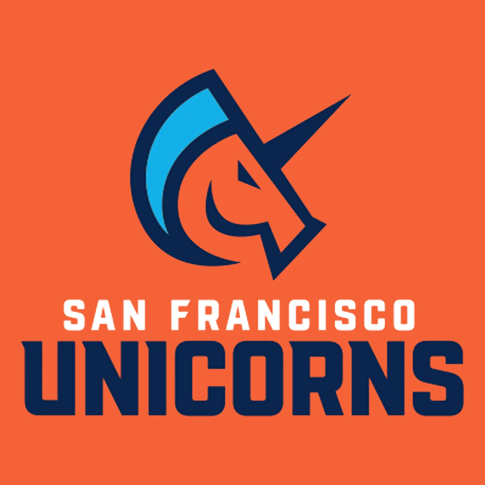
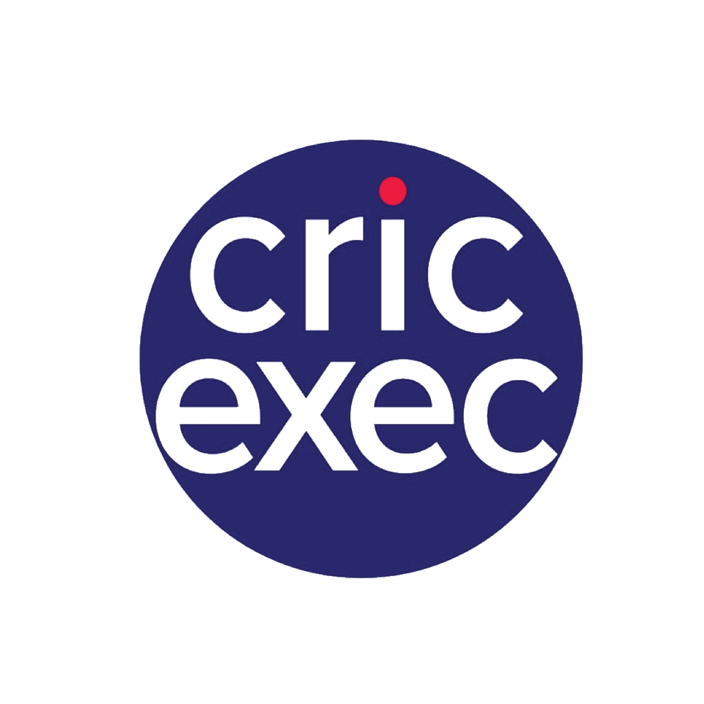
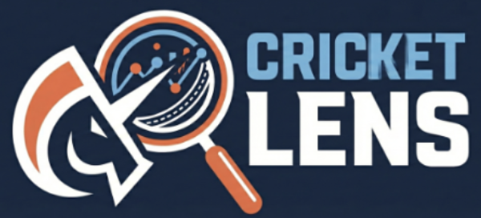
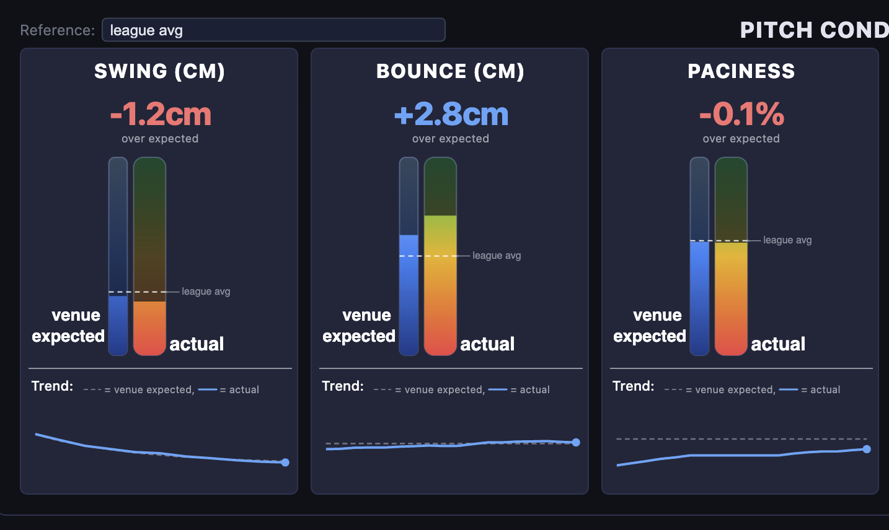

## Celebrities

-   During my time at UCLA I've been lucky enough to meet a lot of basketball players and a few other celebrities! My work with the SF Unicorns has also led to various interactions with international cricket players. Take a look at the photo gallery to see who I've met

::: {style="text-align: center;"}
[Open Gallery](celebrities.html){.btn .btn-outline-primary}
:::

## SF Unicorns

::: {.unicorn-links}

  
  
SF Unicorns Team Page

  
  
The Future of Cricket Analytics

:::

-   My role on the SF Unicorns has varied depending on the time of year. During my internship in summer 2025, I helped Professor Vishal Misra with validating his score prediction algorithm as well as initial testing of cricket-lens through mediums such as Twitter and WhatsApp. cricket-lens is now publicly available, you can access it using the link below. Feel free to ask it any cricket related question and test its boundaries!

::: {.cricket-lens-link}

cricket lens

:::

-   From January to September of 2026, I collaborated closely with the Unicorns AI team
    -   I tested various score projection and win probability models, taking into account team strengths and venue history, as well as live game score
    -   I worked on draft analysis, scouting minor league players and creating a stack-ranked draft list for the domestic draft for the 2026 season
    -   Worked with real time hawkeye data and built a dashboard that was used during games in the dugout. The dashboard delivered live insights on pitch conditions and trends, allowing coaches and players to make informed decisions quickly. Indian cricket star Ravichandran Ashwin goes over some of the insights in this YouTube video below (watch with English subtitles if you don't understand Tamil)
    -   Built a model to classify delivery types (ex: off cutter, back of the hand, inswing) which would lead to further analysis on pitch sequencing and bowler specific patterns

::: {.dashboard-video-link}

Ashwin's Video

:::
